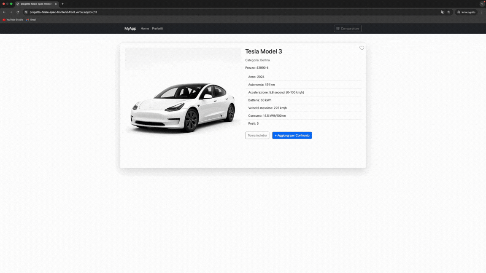
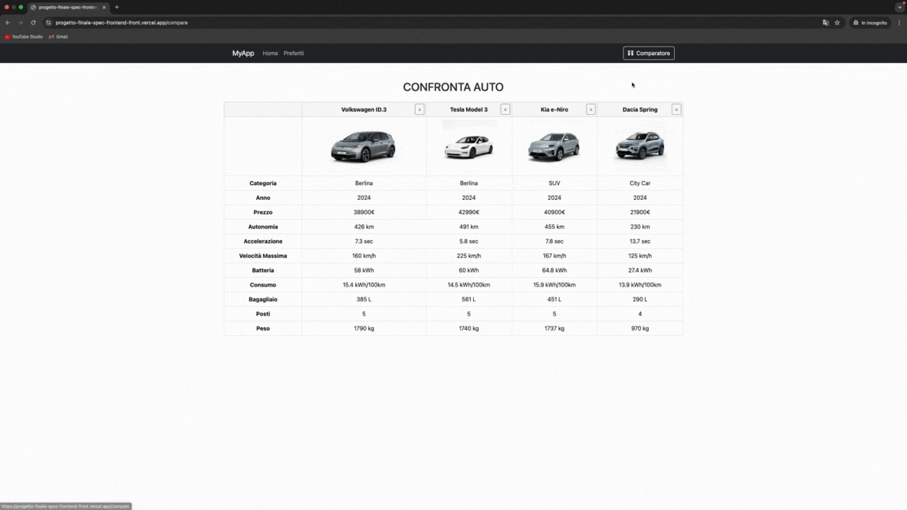
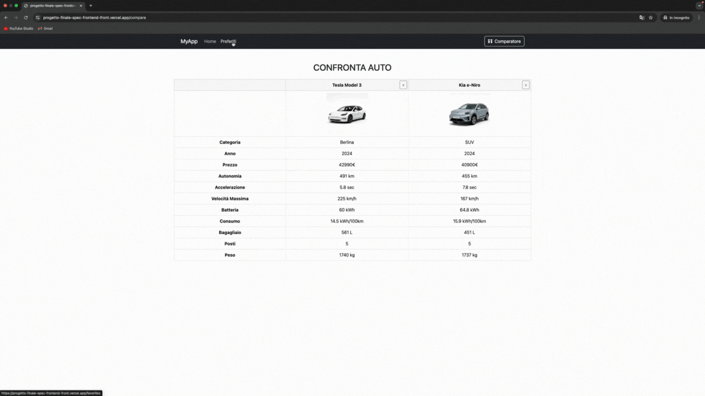

# 🚗 Comparatore di Auto Elettriche

Un’applicazione **full-stack** per confrontare auto elettriche, sviluppata come progetto finale per il corso Full Stack Developer 2024.

---

## ⚡ Demo online

👉 [App live su Vercel](https://progetto-finale-spec-frontend-front.vercel.app/)

---

## 🚀 Funzionalità principali

### 1. **Home Page**

- Visualizza tutte le auto disponibili


- Filtra per categoria e ordina alfabeticamente


### 2. **Pagina Dettaglio**
- Visualizza tutte le specifiche tecniche di un'auto
- Aggiungi o rimuovi l'auto dai preferiti
- Pulsante per confrontare l'auto con altre



### 3. **Confronto**
- Confronta fino a 4 auto fianco a fianco
- Visualizza le specifiche tecniche in una tabella comparativa



### 4. **Preferiti**
- Salva le auto preferite
- Rimuovi le auto dalla lista dei preferiti



---

## 🎥 Demo / GIF

| Home Page | Pagina Dettaglio | Confronto |
|-----------|------------------|-----------|
|  |  |  |

---

## 🏗️ Architettura del progetto

```
progetto-finale-spec/
├── backend/ 
├── progetto-finale-spec-frontend-front/
│ ├── public/ 
│ ├── src/
│ │ ├── assets/ 
│ │ ├── components/ 
│ │ ├── context/ 
│ │ ├── layouts/ 
│ │ ├── pages/ 
│ │ ├── App.jsx 
│ │ ├── index.css 
│ │ └── main.jsx 
│ ├── .env 
│ ├── .gitignore
│ ├── eslint.config.js
│ ├── index.html
│ ├── package-lock.json
│ ├── package.json
│ ├── vercel.json 
│ └── vite.config.js
├── README.md 
```

---


---

## 🔎 Dettagli tecnici e decisioni progettuali

🔗 Gestione fetch/API
Tutte le chiamate dati usano una variabile d’ambiente VITE_BASE_URL, settata sia in locale che su Vercel.

Esempio fetch:

```
// context/GlobalContext.js
const url = import.meta.env.VITE_BASE_URL;
const fetchSingleCar = async (id) => {
    const response = await fetch(`${url}${id}`);
    const data = await response.json();
    setSingleCar(data);
}
```
Lato backend, le API rispondono con struttura { success: true, electriccars: { ... } }.

🔄 Stato globale & gestione favoriti/confronto
Gestito con Context API React,
con funzioni per aggiungere/rimuovere dalle liste e confronto multiplo.

Snippet favoriti:

```
const addFavoritesList = (car) => {
    if (!favoriteCars.some(f => f.id === car.id)) {
        setFavoriteCars(prev => [...prev, car]);
    }
}
```